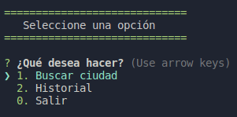
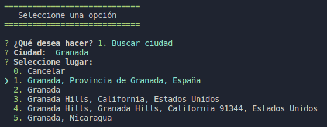
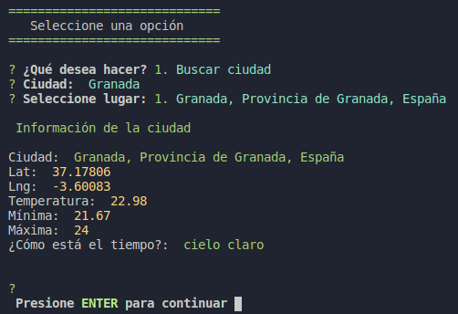

# curso-node-climaApp
tercera aplicación del [curso de Node](https://www.udemy.com/course/node-de-cero-a-experto/).

En esta aplicación se ha desarrollado un pequeño programa de consola en la que se puede consultar el tiempo de una ciudad usando para ello llamadas a la api de [Mapbox](https://www.mapbox.com/) y a la de [OpenWheather](https://openweathermap.org/).

Para ejecutar:

```
npm start
```

 

 

 